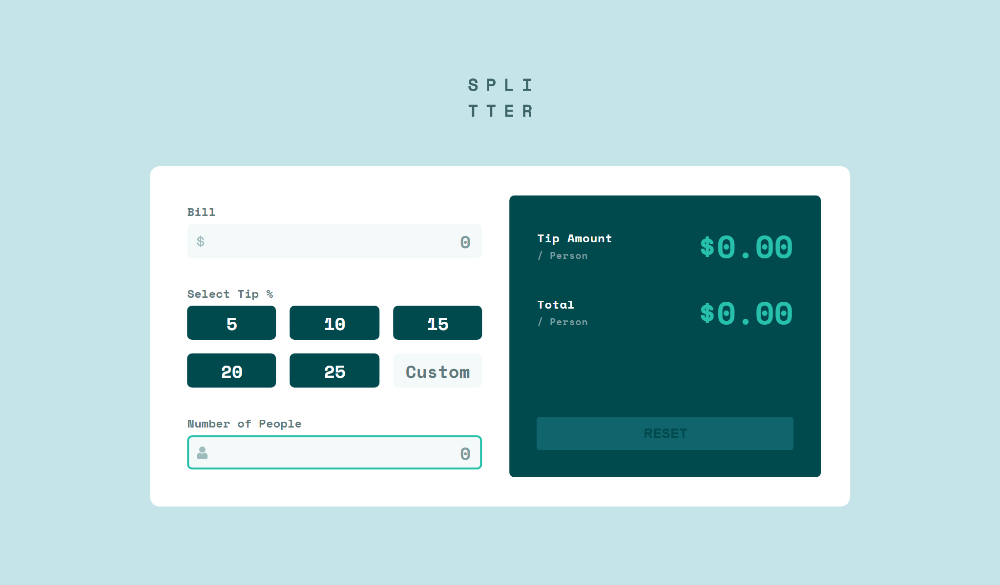

# Frontend Mentor - Tip calculator app solution

This is a solution to the [Tip calculator app challenge on Frontend Mentor](https://www.frontendmentor.io/challenges/tip-calculator-app-ugJNGbJUX). Frontend Mentor challenges help you improve your coding skills by building realistic projects.

## Table of contents

- [Overview](#overview)
  - [The challenge](#the-challenge)
  - [Screenshot](#screenshot)
  - [Links](#links)
- [My process](#my-process)
  - [Built with](#built-with)
  - [What I learned](#what-i-learned)
  - [Continued development](#continued-development)
  - [Useful resources](#useful-resources)
- [Author](#author)

## Overview

### The challenge

Users should be able to:

- View the optimal layout for the app depending on their device's screen size
- See hover states for all interactive elements on the page
- Calculate the correct tip and total cost of the bill per person

### Screenshot

### Links

- Live Site URL: [Tip calculator app](https://shaina1999.github.io/tip-calculator/)

## My process

### Built with

- Semantic HTML5 markup
- CSS custom properties
- Flexbox
- CSS Grid
- Desktop-first workflow
- [SASS](https://sass-lang.com/) - For CSS preprocessor
- Vanilla JS

### What I learned

While developing this project, i learn how to get the user input in "realtime" (meaningly, as the user types) while calculating and displaying in the user interface the total value. I use the "keyup" event to get what the user types in the input field.

### Continued development

After i finish this project, i notice that i still need to perfect my style of coding in JavaScript, bacause i believe that there is other efficient way of getting the user input from the input field using JavaScript.

## Author

- Website - [Shaina De Guzman](https://shainadeguzman.netlify.app/)

Thanks for checking out this project.
